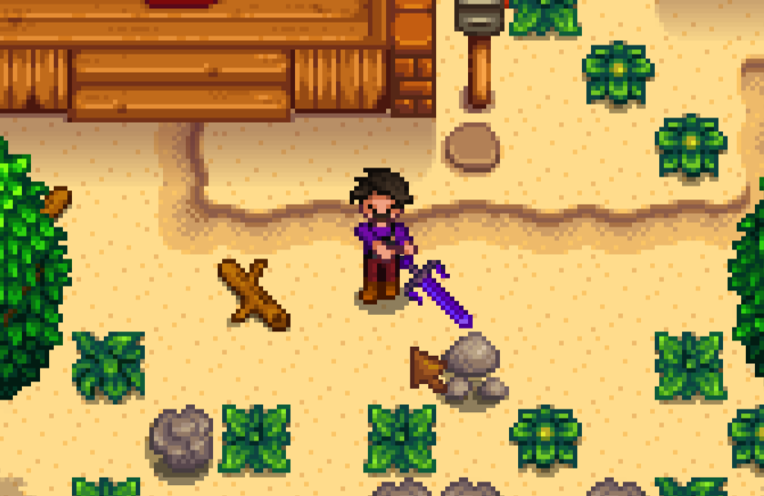

# Stardew Valley OmniSwing Mod

Automatically swing your weapon.

## Install

1. Install the [latest version of SMAPI](https://smapi.io).
1. Download this mod and unzip it into `Stardew Valley/Mods`.
1. Run the game using SMAPI.

## How to use

Just hold click to automatically swing your weapon in the facing direction.

This mod's name is a reference to the [same-titled-mod for Terraria](https://github.com/gardenappl/OmniSwing).

This mod is configurable, check `Stardew Valley/Mods/Quick Sell/config.json` for its settings.

## Compatibility

- Works with Stardew Valley 1.3 beta on Linux/Mac/Windows.
- Works in single player and multiplayer.
- Works with a controller.

## Known bugs

- Might make your weapon disappear visually.

## See also

This mod is open source and licensed under MIT, check it out.

- Release notes
- [Official discussion thread](https://www.nexusmods.com/stardewvalley/mods/7877?tab=posts)
- [Source code](https://github.com/AlejandroAkbal/Stardew-Valley-OmniSwing-Mod)

## Support

If you have found this mod useful, please endorse it!

Or support me financially.

- [GitHub Sponsors](https://redirect.akbal.dev/github/sponsor)
- [LiberaPay](https://redirect.akbal.dev/liberapay)
- [PayPal](https://redirect.akbal.dev/paypal)
